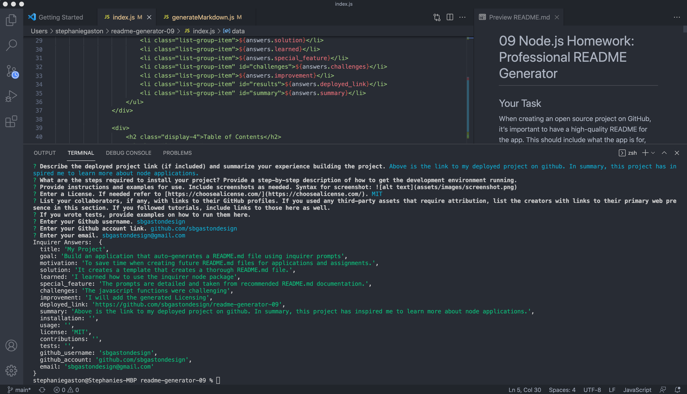

# readme-generator-09
Creates a command-line application that dynamically generates a professional README.md file from a user's input using the Inquirer package.

## Goal:
The goal was to create a node.js app that uses the inquirer package prompts to customize a README.md file that could be used for future projects.

## Issues:
- I had issues populating the data into a README.md file. Although I utilized many resources in trying to find a solution I could not get it to work. 

## Results:

https://drive.google.com/file/d/1Dg-q6-Vfw2qgyqAyiJ5WeJizuDC--bfW/view?usp=sharing

## Github link:
https://github.com/sbgastondesign/readme-generator-09

## Table of Contents
- [Goal](#Goal)
- [Issues](#Issues)
- [Results](#Results)

_____
### License
MIT License, Copyright (c) [2021] [StephanieGaston]